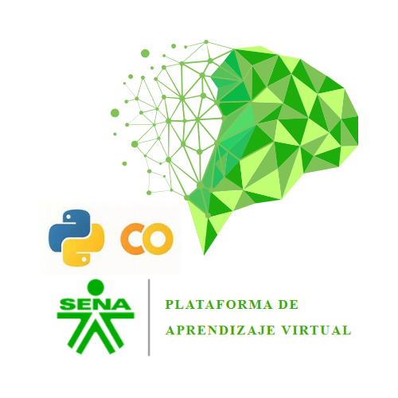

  

<h1 align="center">
  AA2 – Analítica de Datos mediante Inteligencia Artificial
</h1>

  <strong>Programa SENA:</strong> Aplicación de la inteligencia artificial en la integración de datos  
  <strong>Código del programa:</strong> 21720207  
  <strong>Competencia:</strong> 220501115 – Integrar datos según procedimiento técnico y especificaciones de proceso de negocio  
  <strong>Resultado de aprendizaje:</strong> 
  220501115-02. Procesar datos implementando herramientas de IA generativa, procedimiento técnico y metodología estadística.

## Introduccion
Este repositorio contiene el desarrollo de las actividades prácticas asociadas a la **Actividad de aprendizaje AA2** de la guía de formación del SENA.  
Su propósito es aplicar herramientas de **analítica de datos** e **inteligencia artificial** para:

- Procesar conjuntos de datos  
- Identificar patrones estadísticos  
- Generar documentación técnica  
- Apoyar decisiones con visualizaciones

El análisis se desarrolla con un dataset **bioinformático de uso abierto**.

## Objetivos
- Aplicar metodologías técnicas para la **limpieza, transformación y análisis estadístico de datos**
- Integrar IA generativa en tareas de procesamiento, análisis y documentación
- Interpretar resultados desde una perspectiva funcional orientada a decisiones

##  Dataset
 **Breast Cancer Wisconsin Dataset**  
Aplicado en bioinformática para diagnóstico temprano del cáncer de mama.

> Este dataset no contiene datos personales identificables.

## ¿Cómo ejecutar los notebooks?

1️. Abrir cada archivo `.ipynb`  
2️. Hacer clic en el botón:  
**“Abrir en Google Colab”**

 Requisitos:
- Conexión a Internet
- Cuenta de Google

## Autor
> **Nombre:** Leon, E. 
> **Instructor:** Javier Perez Campo

## Referencias
- Componentes formativos SENA:  
  [_Recolección, tratamiento y visualización de datos para IA_]()  
  [_Estrategias de integración y análisis de datos mediante IA_]()
- [Biblioteca científica UCI Machine Learning Repository (datos bioinformáticos)]()

